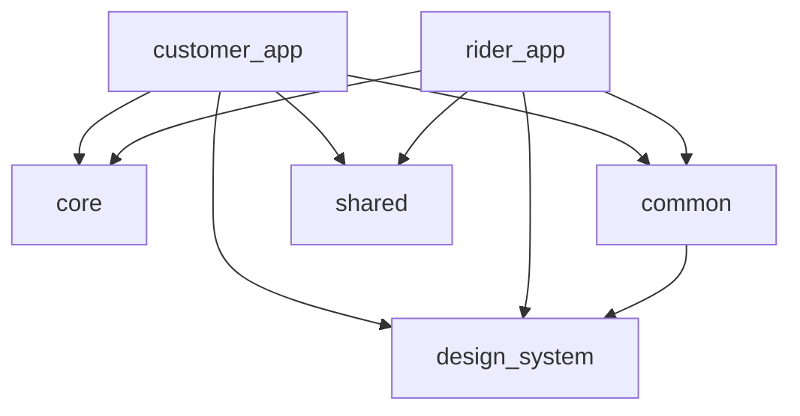

# Flowery

Flowery is a flower delivery product built as a **Flutter monorepo** containing two independent apps that share one design system and one technical foundation.

| App | What it's for |
|---|---|
| **Customer app** (`apps/customer_app`) | The shopping app — browse a flower catalog, add to cart, check out, pay, and track delivery. |
| **Rider app** (`apps/rider_app`) | The delivery app — apply to become a rider, accept incoming orders, and move a delivery through pickup → in‑transit → delivered. |

They're separate products for separate users (a customer never sees rider screens, and vice versa) developed in one repository so they can share a design system, reusable widgets, and technical infrastructure (error handling, DI, base Cubit) — see [Project structure](#project-structure).

---

## Main features

**Customer app**
- Authentication — login, sign up, forgot/reset password, continue as guest
- Home & catalog — categories, best sellers, occasions, search, product details
- Cart, checkout (address + payment method), and order placement
- Order history and live order tracking
- Profile — edit details, saved addresses, reset password, logout

**Rider app**
- Onboarding and "apply to become a rider" flow
- Authentication — login, forgot/reset password
- Incoming delivery requests — accept / reject
- Delivery workflow — pickup → in‑transit → delivered, with map screens at each step
- Order history and profile management

> See [Current status](#current-status) for what's actually implemented today versus planned.

---

## Architecture

- **Monorepo** — two apps + four shared packages, managed with [Melos](https://melos.invertase.dev), so shared code lives in one place instead of being duplicated across two repos.
- **Clean Architecture** — every feature is split into `presentation` (views + Cubit + sealed state) → `domain` (entities + repository contracts) → `data` (repository implementations + data sources). Business logic lives in Cubits/repositories, never in a widget.
- **MVI + Cubit** — `flutter_bloc`'s `Cubit` is the state handler. A user action calls a Cubit method (the "intent"), the Cubit updates a sealed `State`, and the view reacts via `BlocBuilder`/`BlocConsumer`.
- **GetIt** — dependency injection / service locator. Each app has its own composition root; `packages/core` registers cross-cutting infrastructure.
- **GetX** — used **only** for navigation (`GetMaterialApp`, `Get.toNamed`, ...). It is not used for state management anywhere in this codebase.
- **SOLID / OOP** — repositories are accessed through interfaces, every class has one responsibility, and states are `sealed` so handling is exhaustive by construction.



Packages never depend on an app, and the two apps never depend on each other.

**Data flow:** `View → Cubit (intent) → Repository interface → Repository impl → Data source → Result<Success|Failure> → State → View`

---

## Project structure

```text
apps/
├── customer_app/     # Flowery — customer / e-commerce app
└── rider_app/        # Flowery Rider — delivery / tracking app

packages/
├── core/              # network/error/result contracts, DI instance, base Cubit — no UI
├── common/            # reusable, app-agnostic widgets (buttons, inputs, dialogs, state views)
├── design_system/     # colors, typography, spacing, theme, shared brand assets
└── shared/            # domain models used by both apps (User, Address) — pure Dart

docs/                  # Figma analysis and other reference docs
README.md
melos.yaml
```

---

## Figma

Figma is the **source of truth for UI/UX** — layout, spacing, components, and visual structure.

- **Design file:** [Figma — Flower app](https://www.figma.com/design/jefwMXqsdkzUdJgfyM9otG/Flower-app?node-id=217-640&t=O9aY9pm7bCpMdofy-0)
- **Full flow analysis:** [`docs/Flower_App_Figma_Analysis.md`](docs/Flower_App_Figma_Analysis.md) — screen inventory, navigation flows, and open design questions. Read it before implementing a screen.

---

## Design system

Shared across both apps via `packages/design_system` and `packages/common`:

- **Colors, typography, spacing, and radii** as named tokens (`AppColors`, `AppDimens`, `AppTextStyles`) — never hardcode a raw value in a widget.
- **Theme** — one shared `ThemeData` (`AppTheme.light`) consumed by both apps.
- **Shared components** — buttons, text fields, dialogs, loading/error/empty states, in `packages/common`.
- **Assets** — brand assets (logo, icon, fonts) in `packages/design_system`; app-specific images/icons/animations in each app's own `assets/`, all referenced through an `AppAssets` registry, never a raw path string.
- **English / Arabic** — translation files exist per app; not yet wired into a runtime localization pipeline (copy currently comes from a centralized strings file).
- **RTL / LTR** — shared widgets use Flutter's standard directionality-aware layout; no language switcher is wired up yet.

---

## Current status

| Area | Status |
|---|---|
| Customer — Auth (login, sign up, forgot/reset password) | ✅ Implemented |
| Customer — Splash | ✅ Implemented |
| Customer — Home / Catalog | 🟡 In progress (data + Cubit exist, views pending) |
| Customer — Cart, Checkout, Orders, Notifications, Profile | ⬜ Planned |
| Rider — all features (onboarding, auth, apply, home, delivery, orders, profile) | ⬜ Planned (architecture scaffold only) |
| Routing (both apps) | ⬜ Not wired yet — no screen is routed via `GetPage` |
| API / backend integration | ⬜ Not started — data sources are in-memory placeholders |

---

## Setup

**Requirements:** Flutter/Dart SDK compatible with `^3.5.0`, and Melos.

```bash
git clone https://github.com/menna3lwan/flower_app.git
cd flower_app
dart pub global activate melos
melos bootstrap
```

Run the Customer app:

```bash
cd apps/customer_app
flutter run
```

Run the Rider app:

```bash
cd apps/rider_app
flutter run
```

Analyze and test the whole workspace:

```bash
melos run analyze
melos run test
```

---

## Contribution

1. Create a feature branch (`feature/<short-description>`) off `development`.
2. Follow Clean Architecture + MVI — `presentation/domain/data` per feature, business logic in Cubits/repositories only.
3. Follow the existing naming and architecture rules (see `packages/core`/`design_system` for established patterns).
4. Match the linked Figma design.
5. Run `melos run analyze` and `melos run test` before opening a PR.
6. Open a Pull Request against `development`.

---

## Documentation

| File | Contents |
|---|---|
| `README.md` | This file — project overview, architecture, setup |
| `docs/Flower_App_Figma_Analysis.md` | Full Figma flow analysis, screen inventory, and design system reference |
