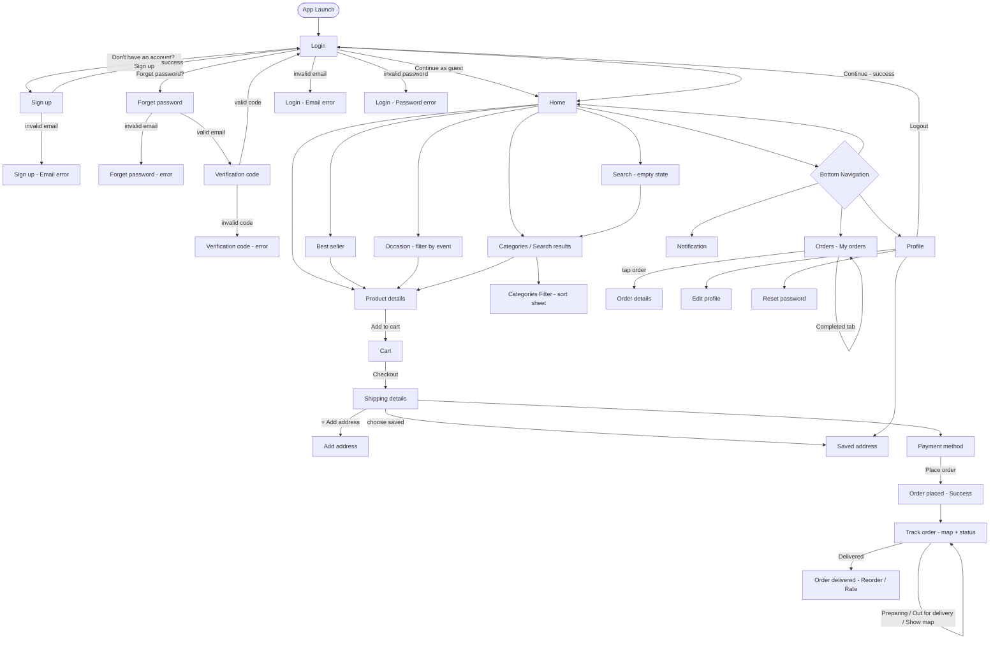
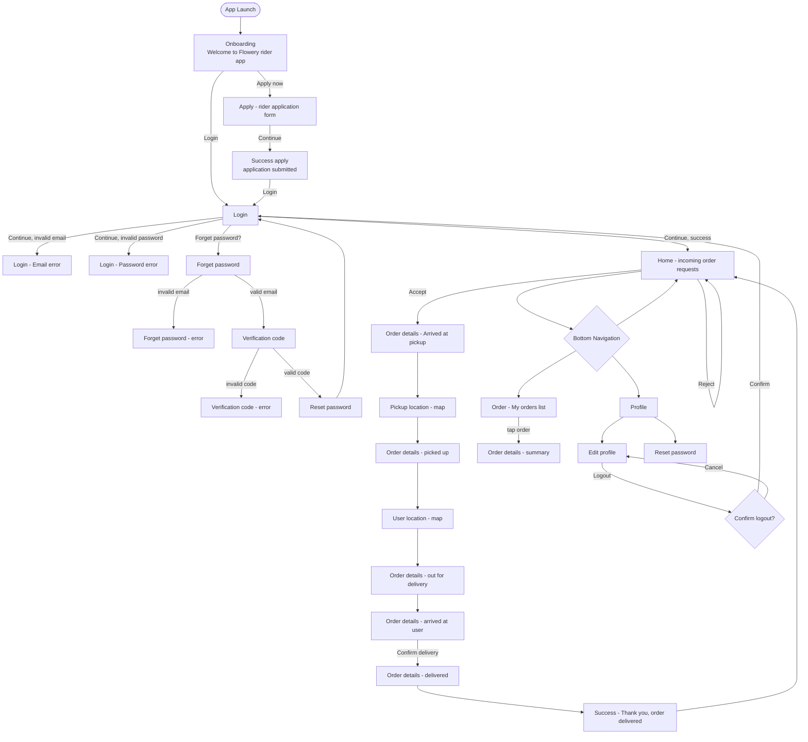

# Flower App — Figma Analysis & Flow Documentation

**Source of truth:** [Figma — Flower app](https://www.figma.com/design/jefwMXqsdkzUdJgfyM9otG/Flower-app?node-id=217-640)
**Status:** Analysis only. No implementation was performed or modified while producing this document.

> **Repository scope note:** This document analyzes the *entire* Figma file, which contains designs for two applications (see section 2). This repository (`flower_app`) implements **Application 1 — the Customer / E-commerce app — only**. Application 2 (Rider / Tracking app) content below is kept as an accurate record of what exists in the Figma source file, for reference only; it is not being built here and should not be treated as a pending feature of this repo.

---

## 1. Figma Overview

The Figma file contains **three pages**:

| Page | Content |
|---|---|
| **E-commerce app** | The customer-facing shopping application (browse, cart, checkout, order tracking, profile). |
| **Tracking app** | The delivery rider/driver application (accept orders, fulfil deliveries, track earnings/orders, profile). |
| **Design System** | Shared colors, icons, components, and a generic map/keyboard reference kit used across both apps. |

There is **no screen literally named "Splash"** anywhere in the file (confirmed by exhaustive search for "splash", "launch", "onboard", "welcome" across both app pages). The closest equivalent is an **"Onboarding"** frame, and it belongs only to the Tracking (Rider) app — the E-commerce app has no landing/welcome frame before its Login screen.

Frame names in Figma are not always literal screen purposes (e.g. several frames are named "Login screens" but are actually decorative section-header labels, not real screens). Every screen below was verified by opening the frame, not just by its layer name.

---

## 2. The Two Applications

### Application 1 — Flowery (Customer / E-commerce app)

- **Target user:** End customer buying flowers.
- **Main purpose:** Browse flower catalog, purchase, track delivery, manage account.
- **Entry point:** Login screen (no dedicated splash/welcome frame exists in Figma for this app).
- **Exit:** Logout from Profile.
- **Core loop:** Browse → Product details → Cart → Checkout → Payment → Track order → Rate/Reorder.

### Application 2 — Flowery Rider (Driver / Tracking app)

- **Target user:** Delivery rider fulfilling flower orders.
- **Main purpose:** Apply to become a rider, log in, accept delivery jobs, update delivery status in real time, review completed orders.
- **Entry point:** **Onboarding** screen — "Welcome to Flowery rider app" with two actions: **Login** and **Apply now**.
- **Exit:** Logout from Edit Profile (confirmation dialog).
- **Core loop:** Home (incoming requests) → Accept → Order details (pickup → in‑transit → delivered) → Success.

These are two separate, self-contained apps sharing one design system (colors/typography/components) and brand (Flowery). No screens or navigation are shared between them.

---

## 3. Complete Flow — Application 1 (Customer / E-commerce)



**Notes on this flow:**
- The Figma file contains **two parallel iterations** of the checkout + tracking sequence: a shorter one (Shipping details → Track order, 4 tracking states) and a more detailed one labelled *"Another version of Checkout & Tracking"* (Cart → Shipping details ×2 → Payment → 8 tracking states including a live map and a final rate/reorder screen). They represent the same feature at two design stages; the second (longer) version appears to be the more complete/later iteration. See **Open Questions**.
- "Continue as guest" on Login skips authentication and goes straight to Home — Figma does not show what, if anything, is restricted for guest users (e.g. can a guest checkout, or is guest read-only?).

---

## 4. Complete Flow — Application 2 (Rider / Tracking app)



**Notes on this flow:**
- The five "Order details" frames represent **progressive delivery states** of a single order (pickup → in‑transit → delivered), each with a different primary action button ("Arrived at Pickup point", "Confirm delivery", etc.) rather than five different screens users choose between.
- A duplicate section, *"Another version of main flow"*, mirrors the same Home → Order details → map → Success sequence. Treated as an alternate/earlier iteration of the same flow — see **Open Questions**.

---

## 5. Screen-to-Screen Navigation Map

### Application 1 (Customer)

```text
Login
 ├── Sign up (link)
 ├── Forget password (link)
 ├── Continue as guest (button) → Home
 └── Continue (button, valid) → Home

Home
 ├── Product card tap → Product details
 ├── Best seller "See all" → Best seller
 ├── Occasion tab → Occasion
 ├── Search bar → Search → Categories (results)
 └── Bottom nav → Orders / Notification / Profile

Product details
 └── Add to cart → Cart

Cart
 └── Checkout → Shipping details

Shipping details
 ├── + Add address → Add address (modal/screen)
 ├── Choose saved address → Saved address
 └── Next/Place order → Payment → Track order

Track order
 └── Delivered → Order delivered (Reorder / Rate)

Profile
 ├── Edit profile
 ├── Reset password
 ├── Saved address
 └── Logout (dialog) → Login
```

### Application 2 (Rider)

```text
Onboarding
 ├── Login → Login
 └── Apply now → Apply → Success apply → Login

Login
 ├── Forget password → Forget password → Verification code → Reset password → Login
 └── Continue (valid) → Home

Home (incoming requests)
 ├── Accept → Order details 1 (pickup)
 └── Reject → stays on Home

Order details (chain)
 pickup → Pickup location (map) → picked up → User location (map)
 → out for delivery → arrived → Confirm delivery → Success → Home

Bottom nav: Home / Order (history) / Profile

Order (history)
 └── tap item → Order details (read-only summary)

Profile
 ├── Edit profile → Logout (confirm dialog) → Login
 └── Reset password
```

---

## 6. User Roles & Permissions

| Role | App | Access | Key actions | Cannot do |
|---|---|---|---|---|
| **Customer** | E-commerce app | Catalog, cart, checkout, own orders/tracking, own profile/addresses | Browse, add to cart, checkout, pay, track own order, rate/reorder, manage saved addresses, edit profile, logout | No access to rider tools, no order management for other users |
| **Guest (unauthenticated customer)** | E-commerce app | Same Home/browse screens via "Continue as guest" | Browse catalog | Figma does not specify whether guest can complete checkout — flagged as open question |
| **Rider / Driver** | Tracking app | Own incoming job queue, own active delivery, own order history, own profile | Accept/reject job requests, update delivery status through pickup → delivery, view own past orders, edit profile, apply status tracking, logout | No access to customer catalog/cart, no visibility into other riders' orders |
| **Applicant (pre-rider)** | Tracking app | Apply screen only | Submit a rider application (name, email, phone, vehicle info, national ID, gender) | Cannot access Home/order flow until approved and logged in |

The two roles are entirely separate personas on separate apps; there is no shared account or shared screen between Customer and Rider.

---

## 7. Screen Inventory

### Application 1 — E-commerce app

| Application | Screen | Purpose | Entry From | Navigates To | Role |
|---|---|---|---|---|---|
| Customer | Login | Authenticate | App entry | Home, Sign up, Forget password | Customer/Guest |
| Customer | Login (Email error) | Invalid email validation state | Login | Login | Customer |
| Customer | Login (Password error) | Invalid password validation state | Login | Login | Customer |
| Customer | Sign up | Create account | Login | Login | Customer |
| Customer | Sign up (Email error) | Invalid email on signup | Sign up | Sign up | Customer |
| Customer | Forget password | Request reset email | Login | Verification code | Customer |
| Customer | Forget password (error) | Invalid email state | Forget password | Forget password | Customer |
| Customer | Verification code | Enter OTP | Forget password | Login | Customer |
| Customer | Verification code (error ×2) | Invalid/expired OTP state | Verification code | Verification code | Customer |
| Customer | Home | Browse landing (categories, best seller, occasions) | Login, bottom nav | Product details, Best seller, Occasion, Search | Customer |
| Customer | Best seller | Full product grid | Home | Product details | Customer |
| Customer | Occasion | Filter by event (wedding/birthday/etc.) | Home | Product details | Customer |
| Customer | Product details | Single product view, add to cart | Home/Best seller/Occasion | Cart | Customer |
| Customer | Search (empty) | Search prompt state | Home | Categories (results) | Customer |
| Customer | Search (results)/Categories | Product results + filter chip | Search | Product details, Categories Filter | Customer |
| Customer | Categories Filter | Sort-by bottom sheet (price/new/old) | Categories | Categories | Customer |
| Customer | Cart | Line items, quantities, subtotal | Product details, bottom flow | Shipping details | Customer |
| Customer | Shipping details | Delivery time/address/payment/gift/total | Cart | Add address, Saved address, Payment | Customer |
| Customer | Add address | New address form + map | Shipping details | Shipping details | Customer |
| Customer | Saved address | List of saved addresses | Shipping details, Profile | Shipping details | Customer |
| Customer | Payment | Choose payment method, place order | Shipping details | Track order | Customer |
| Customer | Orders ("My orders") | Active/Completed order list | Bottom nav | Order details | Customer |
| Customer | Notification | Order-related notifications list | Bottom nav | — | Customer |
| Customer | Track order (states ×4/8) | Live status: placed/preparing/out for delivery/map/delivered | Payment, Orders | Order delivered | Customer |
| Customer | Order delivered | Success + Reorder/Rate | Track order | Home/Orders | Customer |
| Customer | Profile (×2 states) | Account summary | Bottom nav | Edit profile, Reset password, Saved address, Logout | Customer |
| Customer | Edit profile | Update account details | Profile | Profile | Customer |
| Customer | Reset password | Change password from settings | Profile | Profile | Customer |

### Application 2 — Tracking (Rider) app

| Application | Screen | Purpose | Entry From | Navigates To | Role |
|---|---|---|---|---|---|
| Rider | Onboarding | Welcome/landing, choose Login or Apply | App entry | Login, Apply | Rider/Applicant |
| Rider | Login | Authenticate rider | Onboarding | Home, Forget password | Rider |
| Rider | Login (Email error) | Invalid email state | Login | Login | Rider |
| Rider | Login (Password error) | Invalid password state | Login | Login | Rider |
| Applicant | Apply | Rider application form (type, name, email, phone, vehicle, national ID, gender, docs) | Onboarding | Success apply | Applicant |
| Applicant | Success apply | Application submitted confirmation | Apply | Login | Applicant |
| Rider | Forget password | Request reset | Login | Verification code | Rider |
| Rider | Forget password (error) | Invalid email state | Forget password | Forget password | Rider |
| Rider | Verification code | Enter OTP | Forget password | Reset password | Rider |
| Rider | Verification code (error ×2) | Invalid/expired OTP | Verification code | Verification code | Rider |
| Rider | Reset password | Set new password | Verification code | Login | Rider |
| Rider | Home | Incoming delivery requests (Accept/Reject) | Login, bottom nav | Order details | Rider |
| Rider | Order details (pickup/in‑transit/delivered states) | Active order workflow with contextual action button | Home | Pickup location, User location, Success | Rider |
| Rider | Pickup location | Map to pickup point | Order details | Order details | Rider |
| Rider | User location | Map to delivery address | Order details | Order details | Rider |
| Rider | Success | Delivery completed confirmation | Order details | Home | Rider |
| Rider | Order ("My orders") | Rider's order history, cancelled/completed counts | Bottom nav | Order details (summary) | Rider |
| Rider | Order details (summary) | Read-only completed order info | Order (history) | — | Rider |
| Rider | Profile | Rider account summary | Bottom nav | Edit profile, Reset password | Rider |
| Rider | Edit profile | Update rider details, includes Logout | Profile | Profile, Login (via logout) | Rider |
| Rider | Reset password | Change password from settings | Profile | Profile | Rider |

---

## 8. Feature Map

```text
Application 1 — Flowery (Customer)
│
├── Authentication
│   ├── Login (+ email/password error states)
│   ├── Sign up (+ email error state)
│   └── Forgot Password (email → OTP → reset)
│
├── Home / Discovery
│   ├── Home (categories, best sellers, occasions)
│   ├── Best seller
│   ├── Occasion filter
│   ├── Search (empty + results)
│   └── Categories filter (sort sheet)
│
├── Product
│   └── Product details
│
├── Cart & Checkout
│   ├── Cart
│   ├── Shipping details
│   ├── Saved address / Add address
│   └── Payment
│
├── Orders & Tracking
│   ├── Orders (Active/Completed)
│   ├── Notification
│   └── Track order (live status + map + delivered/rate)
│
└── Profile
    ├── Profile
    ├── Edit profile
    ├── Reset password
    └── Saved address / Logout


Application 2 — Flowery Rider
│
├── Onboarding
│   └── Welcome (Login / Apply now)
│
├── Authentication
│   ├── Login (+ email/password error states)
│   └── Forgot Password (email → OTP → reset)
│
├── Apply (become a rider)
│   ├── Apply form
│   └── Success apply
│
├── Delivery Operations (Main Flow)
│   ├── Home (incoming requests, accept/reject)
│   ├── Order details (pickup → in-transit → delivered states)
│   ├── Pickup location (map)
│   ├── User location (map)
│   └── Success (delivery completed)
│
├── Orders (history)
│   ├── Order list (cancelled/completed)
│   └── Order details (summary)
│
└── Profile
    ├── Profile
    ├── Edit profile (+ logout confirmation)
    └── Reset password
```

---

## 9. Shared Design System

### Colors (semantic styles, verified via Figma Dev Mode)

| Style name | Hex |
|---|---|
| White / Base | `#F9F9F9` |
| Main color / Base (brand pink) | `#D21E6A` |
| Black / Base | `#0C1015` |
| Gray | `#535353` |
| Error | `#CC1010` |
| Success | `#0CB359` |
| Light pink | `#F9ECF0` |

Each of the above also has a generated tint/shade ramp (10–90% opacity variants) in the Design System page's "Colors" frame, used for borders, disabled states, and subtle backgrounds (e.g. `White/70 #A6A6A6`, `Black/30 #878787`).

### Typography

- **Font family:** Inter (weight 500 / "Medium" used consistently across sampled text styles).
- **Screen title (app bar):** Inter, Medium, 20px, 100% line height, 0% letter spacing, center-aligned.
- **Button label:** Inter, Medium, 16px.
- Body/placeholder text in inputs appears smaller (~14px) — not exhaustively sampled since this phase is documentation-only; a full type-scale audit (H1–H6, body, caption) should happen before implementation of each feature.

### Components (from Design System "Components" frame + observed across screens)

- **Buttons:** Primary filled (pink `#D21E6A`, white label, fully rounded), Secondary outlined (white fill, gray border, dark label), Disabled state (gray fill).
- **Text field:** 56px height, 4px corner radius, 1px `Gray #535353` border, label above field, supporting/error text below.
- **Bottom navigation bar:** icon + label, active state in Main color.
- **Product card:** image, name, price, quick "Add to cart" button.
- **Order/list item card:** avatar or thumbnail, title, status chip (color-coded via Success/Error), action button(s).
- **Status/tracking map component:** shared between customer Track order and rider Pickup/User location screens.
- **OTP input:** 4-box single-digit fields with individual focus/error borders.
- **Dialog/modal:** used for the rider's logout confirmation ("LOGOUT — Confirm logout?").
- The Design System page also includes an **Icons** grid and a generic **Material design** keyboard/date-picker reference — standard platform components, not custom to this product.

### Major Assets

| Asset | Used in | Notes |
|---|---|---|
| Flower logo (pink flower mark) | E-commerce app canvas, brand mark | Static image/icon, already present in project `assets/images/`. |
| Delivery-rider Lottie illustration ("delivery-service-delivery-man") | Rider Onboarding screen | Sourced from lottiefiles.com — **not a static exportable asset**; would need to be exported as a static PNG snapshot from Figma or replaced with an equivalent Lottie file for implementation. |
| Product photography (bouquets, arrangements) | Product cards throughout E-commerce app | Multiple individual images, one per product. |
| Map imagery | Add address, Pickup location, User location, Track order | Static map mockups in Figma; real implementation would use a live maps SDK. |
| Icon set | Both apps | Standard iconography (back arrow, search, filter, notification, etc.) per the Design System "Icons" frame. |

---

## 10. Future Clean Architecture / MVI Feature Mapping

> **Superseded note:** this section was written before the decision to scope this repository to the Customer / E-commerce app only. The Rider-side bullets below (`onboarding/`, `apply/`, Rider `home/`, Rider `orders/`, `location_tracking/`) are **not** being implemented here and are kept only as a record of the original two-app mapping. For this repo, only the Customer-only bullets are the actual current feature plan (see the [README](../README.md) for what's implemented today).

Mapping only the features that actually exist in Figma — no placeholders.

```text
lib/features/
├── auth/                  # shared pattern, separate DI/routing per app
│   ├── login/
│   ├── signup/            # Customer app only
│   ├── forgot_password/
│   └── (rider: onboarding/, apply/)
│
├── home/                  # Customer: Home/Best seller/Occasion/Search
│   └── (Rider: home/ = incoming order requests, distinct feature)
│
├── catalog/                # Customer only
│   ├── product_details/
│   └── categories_filter/
│
├── cart/                   # Customer only
│
├── checkout/                # Customer only
│   ├── shipping_details/
│   ├── address/            (saved_address, add_address)
│   └── payment/
│
├── orders/
│   ├── (Customer) order_history/, track_order/, notifications/
│   └── (Rider) order_history/, order_fulfillment/ (pickup → delivery state machine), location_tracking/
│
├── apply/                  # Rider only — become-a-rider application
│
└── profile/                 # both apps, separate feature module per app
    ├── edit_profile/
    └── reset_password/
```

Each bullet above should become its own `feature/<name>/{presentation,domain,data}` module per the project's Clean Architecture + MVI convention (Cubit + sealed Intent/State classes, GetIt-registered repositories, GetX for navigation only). Because the two apps (Customer, Rider) are functionally independent products sharing only design tokens, they should likely be modeled as **two separate app targets/flavors or two clearly-separated top-level feature trees**, not intermixed — this is a decision for the architecture-planning step, not this document.

---

## 11. Open Questions / Ambiguous Flows

1. **No true "Splash" screen exists** for either app. The Rider app has an "Onboarding" welcome screen; the Customer app has no landing screen before Login at all. Needs a product decision (already raised separately) on what the Customer app's launch screen should be.
2. **Duplicate flow iterations:** Both apps contain what appear to be two versions of the same core flow — "Cart & Checkout" vs. "Another version of Checkout & Tracking" (Customer), and "Main Flow screens" vs. "Another version of main flow" (Rider). It's unclear which is the current/authoritative version and which is a leftover earlier draft. Needs confirmation before implementation.
3. **Guest checkout scope:** "Continue as guest" on the Customer Login goes to Home, but Figma doesn't show whether a guest can complete checkout/payment or is limited to browsing only.
4. **Rider illustration asset:** The Onboarding illustration is a Lottie animation referenced via an external lottiefiles.com URL, not an exportable static Figma asset. Needs a decision on sourcing (export a static frame vs. obtaining the actual Lottie JSON) before implementation.
5. **"Order" vs "Track order" naming overlap** on the Rider side (Order = history list, distinct from the in-progress Order details in Main Flow) — worth standardizing naming before building the feature module structure to avoid confusion with the Customer app's identically-named "Orders" feature.
6. **Full typography scale** (headings beyond the app-bar title, body/caption sizes, error/helper text sizes) was sampled but not exhaustively audited in this pass — recommend a dedicated type-scale pass at the start of implementing each screen.

---

*This document is analysis/documentation only. No source code, Splash screen, theme, localization, or API integration was modified while producing it.*
